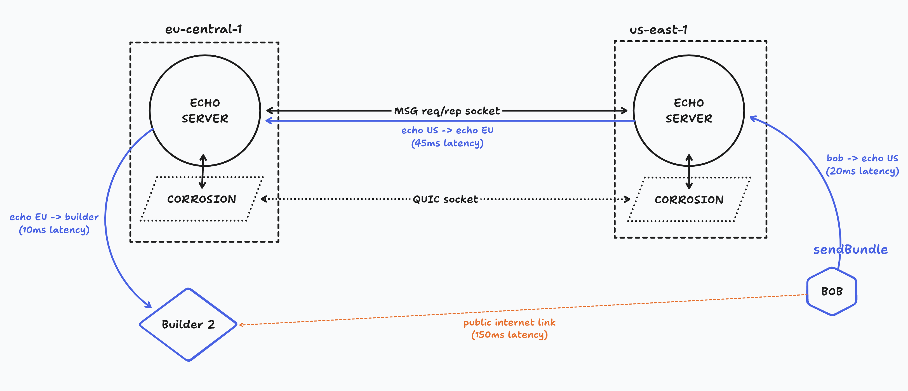

> **Introducing Echo V1.0.0:** A significant upgrade and a complete reinvention of our broadcasting service. Echo 1.0.0 offers advanced capabilities to efficiently reach block builders around the world, combining speed with reliability.

## Key Features of Echo V1.0

- **Geographic Distribution:** Echo's network now spans across the globe. Transactions and bundles are routed to block builders based on geographic proximity and efficiency. This results in quicker and more reliable broadcasting, irrespective of the user's or builders' locations.
- **Comprehensive Internal Redesign:** Echo V1.0.0 represents a total internal transformation. This is achieved mainly with two new components: Fly.io's [Corrosion](https://github.com/superfly/corrosion) as a distributed service discovery layer and shared database, and our own [MSG-RS](https://github.com/chainbound/msg-rs) messaging library for communication.

## How does it work?

The new architecture relies on dedicated nodes that are deployed in strategic locations around the world. **These nodes are connected to the Ethereum block builders and to each other**. This allows us to route transactions and bundles to the closest node, which then broadcasts them to the block builders.
The internal propagation is handled through a private link, which ensures that the messages are delivered to the block builders as quickly as possible.

In the above example, Bob from the United States is trying to send a bundle to a block builder in Europe. The two alternative paths are:

- The builder's own RPC API (the orange line): direct connection with 200ms latency. In normal circumstances, the request will be routed through the public internet, which entails a relatively high latency when compared to datacenter-to-datacenter peerings.
- Echo V1.0 (the blue path): A sum of three components: 20ms for the request to the closest Echo node, then 90ms of internal propagation time to reach the Echo node in Europe, and finally 10ms for the last leg to reach the block builder. This totals 120ms, which is 80ms faster than the direct connection in this specific example.

Of course, the actual latency will vary depending on the user's location and the block builder's own optimizations. However, Echo V1.0 will always try to find the fastest path to the block builder.

## Try it today!

Step into the future with Echo V1.0. Connect with our community on [Discord](https://discord.gg/4abpAT2tXw) to get started!

For existing Echo users, upgrading is dead simple. Simply change the Echo endpoint to:

- HTTP: `https://v1.echo-rpc.io`
- WS: `wss://v1.echo-rpc.io/ws`

**Experience Echo V1.0.0 now – Elevate your MEV broadcasting experience with improved speed and global reach.**
